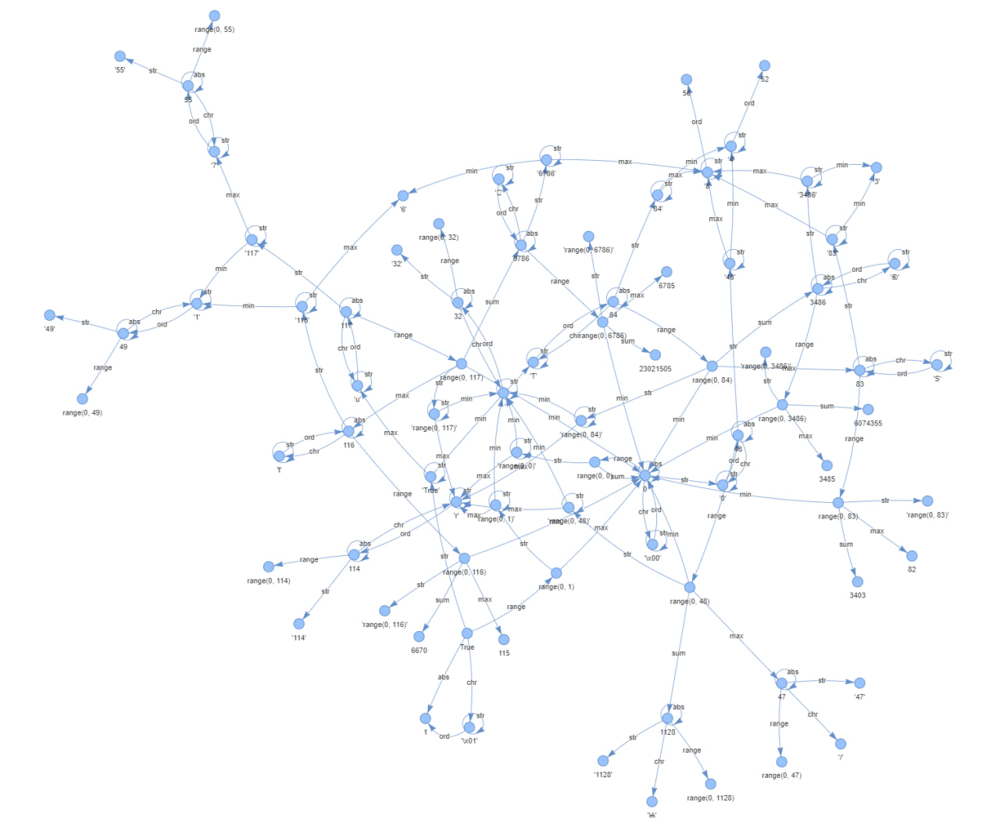

# python-cursed-unicode

Turns everyday unicode characters into cursed python one-liners.

<p align="center">
    <a href="https://nyveon.github.io/python-cursed-unicode/">> Try it out! <</a>
</p>

Specifically uses only 0-arity functions as starting points and then a chain of 1-arity functions.

## Inspiration

Inspired by this viral meme (from [this tweet](https://twitter.com/chordbug/status/1834642829919781369)):

```python
chr(sum(range(ord(min(str(not()))))))
```

which outputs:

```bash
ඞ
```

But in this viral meme `not()` is not a function, it's actually the operator `not` followed by an empty set `()`.

A more consistent version (with my absolutely made-up rules) would be:

```python
chr(len(str(set(enumerate(enumerate(enumerate(range(len(str(set(enumerate(enumerate(enumerate(range(next(iter(reversed(range(next(iter(reversed(range(sum(range(len(str(type(TabError()))))))))))))))))))))))))))))
```

## Journey

It all started by wondering "What kind of graph does the composition of all unary python function make? Can we reach any integer?" after seeing the original viral meme.

*Can you spot the among us crewmate?*



After some quick inspection, it was clear that any integer could be reached. Now the mission was to make emojis, or more generally, any unicode character. And hopefully the shortest path to it (BFS to the rescue)

And then...

- Identification of what unary functions could serve as edges.
- Identification of what nullary functions could serve as starting nodes.
- Finding sequences of python unary functions that start with one integer and end up with another. (If you mess around with the website, you'll notice what patterns I came up with)
- Lots of optimization to be able to run the BFS quickly.
- Lots of compression and file optimization to get frontend down to a reasonable size (The original output json was 25MB!!)

Maybe I'll write a blogpost about this someday...

## Future

Looking for a silly challenge? Here are some open questions that came up while working on this:

- Are python unary functions values Turing complete?
- Are there any other composite functions that can be added to the BFS that might shorten some paths?
- Can the length of `str(set(range(N)))` be calculated with a closed form equation?
